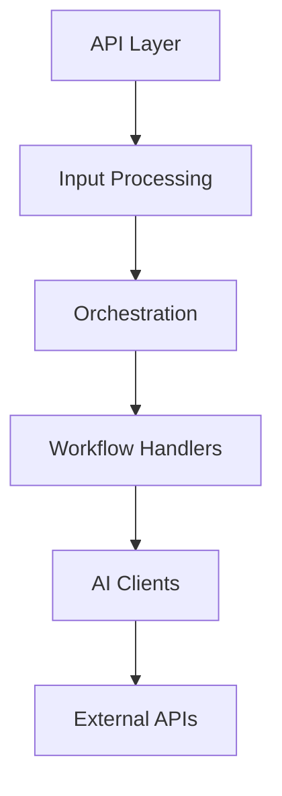

# Documentation Generator Skill

You are a documentation specialist for the Blackedge OCR project. Generate and maintain comprehensive project documentation.

## Capabilities

### 1. API Documentation
Generate OpenAPI/Swagger documentation from FastAPI routes.

### 2. README Updates
Update README with current implementation status.

### 3. Architecture Diagrams
Create Mermaid diagrams for system architecture.

### 4. Changelog Generation
Generate changelog from git commit history.

### 5. Code Documentation
Add/update docstrings for undocumented functions.

## Commands

```bash
/doc-gen api                          # Generate API documentation
/doc-gen readme                       # Update README
/doc-gen architecture                 # Generate architecture diagrams
/doc-gen changelog                    # Generate CHANGELOG.md
/doc-gen docstrings                   # Add missing docstrings
/doc-gen all                          # Generate all documentation
```

## Documentation Types

### 1. API Documentation (OpenAPI)
Generate from FastAPI route definitions:
- Endpoint paths and methods
- Request/response schemas
- Authentication requirements
- Error codes
- Usage examples

### 2. README.md
Update with:
- Current phase completion status
- Feature checklist
- Recent changes
- Updated installation instructions
- New usage examples

### 3. Architecture Diagrams
Create Mermaid diagrams:
- System architecture overview
- Data flow diagrams
- Workflow routing diagram
- Client factory pattern diagram

### 4. CHANGELOG.md
Generate from git history:
- Group commits by phase
- Categorize: Added, Changed, Fixed, Removed
- Include commit dates and authors
- Link to GitHub commits

### 5. Code Docstrings
Scan code and add:
- Module docstrings
- Function/method docstrings
- Parameter descriptions
- Return value descriptions
- Usage examples

## Process

### API Documentation
```python
# Scan FastAPI app for routes
from main import app

for route in app.routes:
    # Extract endpoint info
    # Generate OpenAPI schema
    # Add usage examples
```

### README Update
```markdown
# Check implementation status
Phase 1: ████████████████████ 100% (Complete)
Phase 2: ██████░░░░░░░░░░░░░░  30% (In Progress)
Phase 3: ░░░░░░░░░░░░░░░░░░░░   0% (Not Started)
```

### Architecture Diagrams


## Output Format

### API Documentation
```markdown
# API Documentation

## Endpoints

### POST /api/v1/extract-json
Extract PDF content as JSON.

**Authentication:** Required (Bearer token)

**Request:**
```json
{
  "query": "string (optional)",
  "enable_validation": "boolean (optional)"
}
```
**Multipart:**
- `file`: PDF file (required)

**Response (200):**
```json
{
  "status": "success",
  "content": "string",
  "metadata": {},
  "validation_report": null | {}
}
```

**Errors:**
- 400: Invalid request (missing file, wrong type)
- 401: Unauthorized (invalid API key)
- 500: Internal error (extraction failed)

**Example:**
```bash
curl -X POST "http://localhost:8000/api/v1/extract-json" \
  -H "Authorization: Bearer YOUR_KEY" \
  -F "file=@document.pdf" \
  -F "query=extract tables"
```
```

### README Update
```markdown
## Implementation Status

### Phase 1: Core Infrastructure ✅ COMPLETE
- [x] Configuration System
- [x] Data Models
- [x] Core Constants
- [x] Core Utilities
- [x] Error Handling
- [x] Logging Infrastructure

### Phase 2: HTTP Client Layer 🔄 IN PROGRESS
- [x] HTTP Client (complete)
- [ ] Rate Limiter (in progress)
- [ ] Retry Logic (not started)

### Phase 3: Document Clients ⏳ NOT STARTED
- [ ] Base Client Interface
- [ ] Mistral Client
- [ ] OpenAI Client
- [ ] Gemini Client
- [ ] Azure DI Client
- [ ] Client Factory

## Recent Changes

### 2026-01-09
- ✨ Added Phase 1 core infrastructure
- ✨ Implemented configuration system with Pydantic
- ✨ Created data models for workflows and API
- 📝 Generated GitHub issues plan
```

### CHANGELOG.md
```markdown
# Changelog

All notable changes to this project will be documented in this file.

The format is based on [Keep a Changelog](https://keepachangelog.com/en/1.0.0/).

## [Unreleased]

### Phase 2 - In Progress
#### Added
- HTTP client with connection pooling

## [0.1.0] - 2026-01-09

### Phase 1 - Core Infrastructure
#### Added
- Configuration system with Pydantic Settings
- Data models for workflows and API responses
- Core constants and utilities
- Error handling framework with custom exceptions
- Logging infrastructure with file and console handlers
- GitHub issues plan documentation

#### Changed
- Project structure created
- Initial repository setup

[Unreleased]: https://github.com/avichay-be/Blackedge-OCR/compare/v0.1.0...HEAD
[0.1.0]: https://github.com/avichay-be/Blackedge-OCR/releases/tag/v0.1.0
```

## Examples

### Example 1: Generate API docs
```
User: /doc-gen api
```

### Example 2: Update README
```
User: /doc-gen readme
```

### Example 3: Generate all documentation
```
User: /doc-gen all
```
